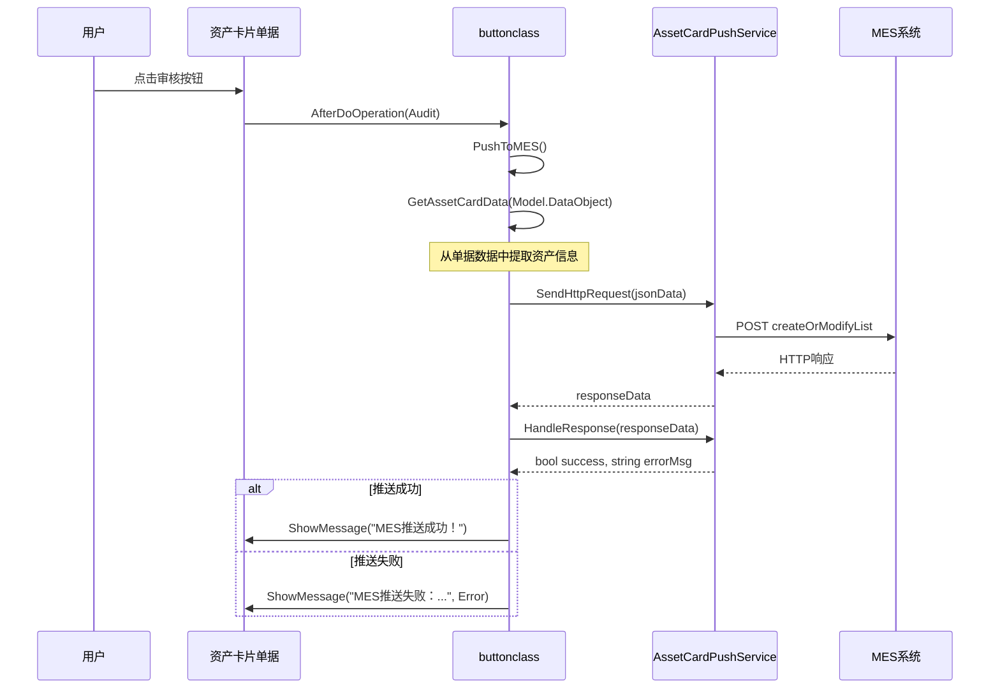
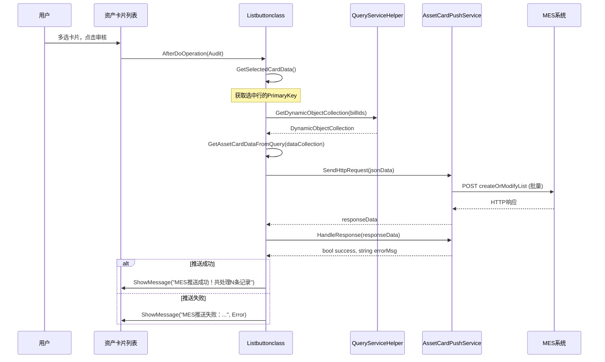
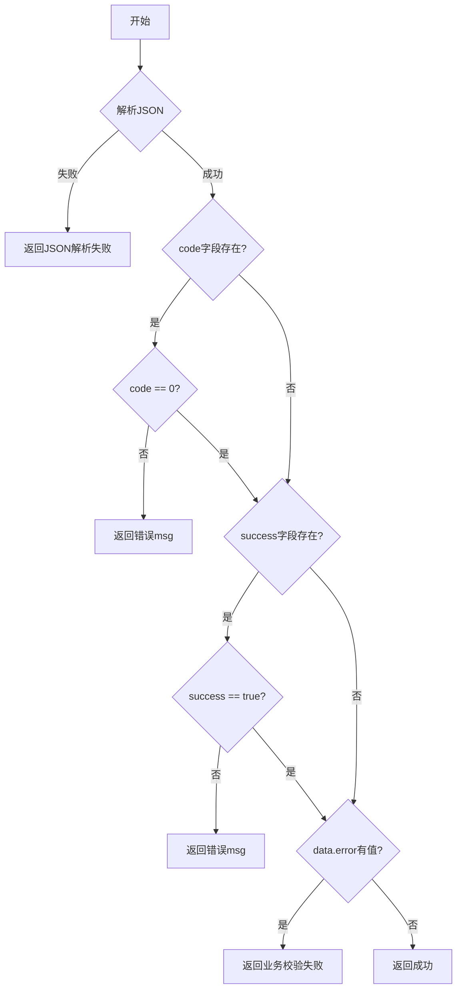

# 资产卡片推送插件技术文档

## 1. 项目概述

### 1.1 项目简介

本项目是基于金蝶 K/3 Cloud 平台开发的资产卡片推送插件，实现资产卡片审核通过后自动将资产数据同步至 MES（制造执行系统）设备档案接口，确保财务资产数据与生产设备数据的一致性。

### 1.2 功能特性

| 功能点 | 描述 |
| :--- | :--- |
| 单张推送 | 资产卡片审核时自动触发推送 |
| 批量推送 | 列表多选审核后批量推送 |
| 数据映射 | 自动将金蝶资产字段映射为MES接口格式 |
| 响应处理 | 支持多种响应格式的解析和错误处理 |
| 日志记录 | 关键节点输出调试日志便于问题排查 |

---

## 2. 技术架构

### 2.1 系统架构图

```
┌─────────────────────────────────────────────────────────────────────┐
│                        金蝶 K/3 Cloud                               │
│  ┌───────────────┐    ┌───────────────┐                           │
│  │  资产卡片单据  │    │  资产卡片列表  │                           │
│  │  (FA_CARD)    │    │  (FA_CARD)    │                           │
│  └───────┬───────┘    └───────┬───────┘                           │
│          │                    │                                    │
│          ▼                    ▼                                    │
│  ┌───────────────┐    ┌───────────────┐                           │
│  │  buttonclass  │    │ Listbuttonclass│  ← 插件入口               │
│  │ (单据插件)    │    │  (列表插件)    │                           │
│  └───────┬───────┘    └───────┬───────┘                           │
│          │                    │                                    │
│          └──────────┬─────────┘                                    │
│                     ▼                                              │
│         ┌─────────────────────┐                                    │
│         │ AssetCardPushService│  ← 核心服务类                      │
│         │  (推送逻辑/HTTP请求) │                                    │
│         └───────────┬─────────┘                                    │
│                     │                                              │
│                     ▼                                              │
│  ┌───────────────────────────────────────────────────────────────┐ │
│  │                    HTTP POST 请求                              │ │
│  │  http://192.168.1.6:80/iMark/v1/DBEquipmentArchivesInfo/     │ │
│  │              createOrModifyList                                │ │
│  └───────────────────────────────────────────────────────────────┘ │
└─────────────────────────────────────────────────────────────────────┘
                                    │
                                    ▼
┌─────────────────────────────────────────────────────────────────────┐
│                            MES 系统                                 │
│              设备档案接口 - DBEquipmentArchivesInfo                 │
└─────────────────────────────────────────────────────────────────────┘
```

### 2.2 核心类职责

| 类名 | 文件 | 职责 |
| :--- | :--- | :--- |
| `buttonclass` | buttonclass.cs | 单据插件，监听审核事件，执行单张推送 |
| `Listbuttonclass` | Listbuttonclass.cs | 列表插件，监听审核事件，执行批量推送 |
| `AssetCardPushService` | AssetCardPushService.cs | 推送服务，封装HTTP请求和响应处理逻辑 |
| `AssetCardModel` | AssetCardPushService.cs | 数据模型，定义MES接口所需字段 |
| `ApiResponse` | AssetCardPushService.cs | API响应模型，用于解析MES返回结果 |
| `ResponseData` | AssetCardPushService.cs | 响应数据模型，包含成功/失败明细 |

---

## 3. 核心流程

### 3.1 单据推送流程



### 3.2 列表批量推送流程



---

## 4. 数据模型

### 4.1 AssetCardModel 字段映射

| MES字段 | 金蝶字段 | 类型 | 说明 |
| :--- | :--- | :--- | :--- |
| `devCode` | F_BHD_Text_xzcbm / FAssetNO | string | 设备编码，优先取自定义字段，否则取资产编码 |
| `devName` | FName | string | 设备名称 |
| `specificationAndModel` | FSpecification | string | 规格型号 |
| `assetCode` | FAssetNO | string | 资产编码 |
| `power` | - | decimal? | 功率（预留字段） |
| `unit` | FUnitID.FName | string | 单位 |
| `quantity` | FQuantity | int? | 数量 |
| `supplier` | FSupplierID.FName | string | 供应商名称 |
| `factoryLeaveCode` | FNumber | string | 出厂编码（单据编号） |
| `factoryLeaveDate` | FAcctDate | string | 出厂日期（财务入账日期） |
| `purchaseDate` | FAcctDate | string | 购入日期（财务入账日期） |
| `storageLocation` | FPositionID.FName | string | 存放地点 |
| `equipmentType` | FAssetTypeID.FName | string | 设备类型 |
| `departmentName` | FAllocUseDeptID.F_BHD_Costcenter | string | 使用部门（成本中心） |
| `manager` | FKEEPERID.FName | string | 负责人 |

### 4.2 请求JSON格式

```json
[
  {
    "devCode": "DEV001",
    "devName": "数控机床",
    "specificationAndModel": "CNC-2024",
    "assetCode": "AST001",
    "unit": "台",
    "quantity": 1,
    "supplier": "XX设备公司",
    "factoryLeaveCode": "FA2024001",
    "factoryLeaveDate": "2024-01-15",
    "purchaseDate": "2024-01-15",
    "storageLocation": "车间A",
    "equipmentType": "生产设备",
    "departmentName": "生产成本中心",
    "manager": "张三"
  }
]
```

### 4.3 响应JSON格式

MES接口支持两种响应格式：

**格式1 - code/msg模式：**
```json
{
  "code": 0,
  "msg": "操作成功",
  "data": {}
}
```

**格式2 - success/msg模式：**
```json
{
  "success": true,
  "msg": "操作成功",
  "data": {
    "success": ["成功记录"],
    "error": ["失败记录"]
  }
}
```

---

## 5. 接口说明

### 5.1 MES接口配置

| 配置项 | 值 |
| :--- | :--- |
| 接口地址 | `http://192.168.1.6:80/iMark/v1/DBEquipmentArchivesInfo/createOrModifyList` |
| 请求方法 | POST |
| Content-Type | application/json |
| 认证方式 | Basic Auth (bg:bg957768) |
| 超时时间 | 30秒 |

### 5.2 类方法说明

#### 5.2.1 AssetCardPushService

| 方法名 | 功能 | 参数 | 返回值 |
| :--- | :--- | :--- | :--- |
| `SendHttpRequest` | 发送HTTP POST请求到MES | `jsonData` (string) - JSON格式的请求体 | `string` - MES响应内容 |
| `HandleResponse` | 解析MES响应，判断是否成功 | `responseData` (string) - 响应内容，`errorMessage` (out) - 错误信息 | `bool` - 是否成功 |
| `GetCostCenterByDeptId` | 根据部门ID获取成本中心编码 | `deptId` (string) - 部门ID | `string` - 成本中心编码 |

#### 5.2.2 buttonclass

| 方法名 | 功能 | 参数 | 返回值 |
| :--- | :--- | :--- | :--- |
| `PushToMES` | 推送资产卡片到MES（完整方法） | `billData` (DynamicObject) - 单据数据，`resultMessage` (out) - 结果消息 | `bool` - 是否成功 |
| `GetAssetCardData` | 从单据数据提取资产卡片列表 | `billData` (DynamicObject) - 单据数据对象 | `List<AssetCardModel>` |

#### 5.2.3 Listbuttonclass

| 方法名 | 功能 | 参数 | 返回值 |
| :--- | :--- | :--- | :--- |
| `GetSelectedCardData` | 获取列表选中的卡片数据 | 无 | `List<AssetCardModel>` |
| `BatchLoadCardData` | 批量加载卡片数据 | `billIds` (List<long>) - 卡片ID列表 | `List<AssetCardModel>` |
| `GetAssetCardDataFromQuery` | 从查询结果转换为资产模型 | `dataCollection` (DynamicObjectCollection) | `List<AssetCardModel>` |
| `ProcessBatchPushWithModel` | 执行批量推送 | `assetDataList` (List<AssetCardModel>) | void |

---

## 6. 部署说明

### 6.1 环境要求

| 项目 | 要求 |
| :--- | :--- |
| .NET Framework | 4.8 |
| 金蝶K/3 Cloud | 支持BOS插件部署 |
| MES系统 | 可访问 `192.168.1.6:80` |

### 6.2 部署步骤

1. **编译项目**：使用 Visual Studio 编译生成 `Ben.HL.FIN.FA.Business.PlugIn.dll`

2. **复制DLL**：将编译后的DLL复制到金蝶K/3 Cloud的WebSite\Bin目录

3. **注册插件**：
   - 登录金蝶K/3 Cloud
   - 进入 BOS设计器 → 资产卡片(FA_CARD)
   - 在单据插件中注册 `Ben.HL.FIN.FA.Business.PlugIn.buttonclass`
   - 在列表插件中注册 `Ben.HL.FIN.FA.Business.PlugIn.Listbuttonclass`

4. **热更新**：插件已标记 `[Kingdee.BOS.Util.HotUpdate]`，支持热部署

---

## 7. 错误处理机制

### 7.1 异常类型及处理

| 异常类型 | 触发场景 | 处理方式 |
| :--- | :--- | :--- |
| `WebException` | 网络连接失败、超时、HTTP错误 | 读取响应流获取详细错误信息 |
| `HttpRequestException` | HTTP请求异常 | 直接抛出错误消息 |
| `JsonException` | JSON解析失败 | 返回原始响应便于调试 |
| `Exception` | 其他未预期异常 | 捕获并显示错误消息 |

### 7.2 响应校验逻辑



---

## 8. 代码优化建议

### 8.1 待改进点

| 序号 | 问题描述 | 影响 | 建议 |
| :--- | :--- | :--- | :--- |
| 1 | API地址硬编码 | 环境切换需重新编译 | 建议配置化，从金蝶基础资料或配置文件读取 |
| 2 | 认证凭据硬编码 | 安全风险 | 建议使用加密存储或配置中心 |
| 3 | 重复的数据转换逻辑 | buttonclass和Listbuttonclass中存在相似的字段映射代码 | 建议抽取公共方法到AssetCardPushService |
| 4 | 缺少日志框架集成 | 仅使用Debug.WriteLine | 建议集成Log4Net或NLog |
| 5 | 同步HTTP请求 | 可能导致界面卡顿 | 建议使用异步请求 |
| 6 | 异常处理过于宽泛 | Exception捕获范围过大 | 建议细分异常类型，增加重试机制 |

### 8.2 代码优化示例

**问题3 - 抽取公共数据转换方法**：

```csharp
// 在AssetCardPushService中增加通用转换方法
public List<AssetCardModel> ConvertToAssetCardModel(DynamicObject billData)
{
    // 统一的字段映射逻辑
}

public List<AssetCardModel> ConvertToAssetCardModel(DynamicObjectCollection dataCollection)
{
    // 统一的字段映射逻辑
}
```

**问题5 - 异步请求优化**：

```csharp
public async Task<string> SendHttpRequestAsync(string jsonData)
{
    using (var client = new HttpClient())
    {
        client.Timeout = TimeSpan.FromSeconds(30);
        var credentials = Convert.ToBase64String(Encoding.UTF8.GetBytes("bg:bg957768"));
        client.DefaultRequestHeaders.Authorization = 
            new System.Net.Http.Headers.AuthenticationHeaderValue("Basic", credentials);
        
        var content = new StringContent(jsonData, Encoding.UTF8, "application/json");
        var response = await client.PostAsync(_apiUrl, content);
        return await response.Content.ReadAsStringAsync();
    }
}
```

---

## 9. 版本历史

| 版本 | 日期 | 变更说明 |
| :--- | :--- | :--- |
| v1.0.0.0 | 2026 | 初始版本，实现资产卡片审核后推送MES功能 |
